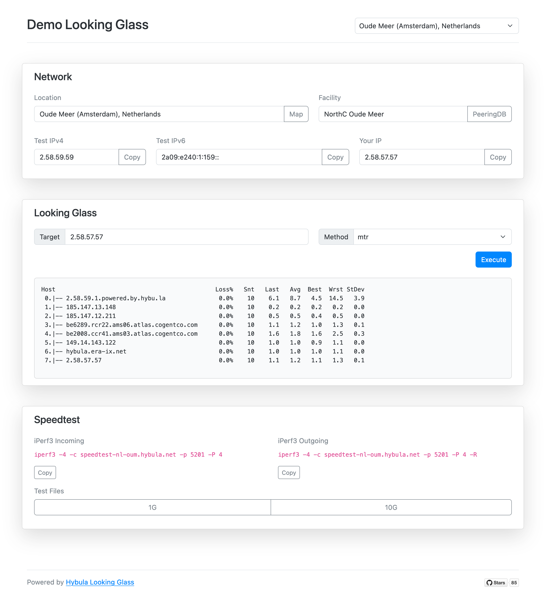

# Looking Glass
Modern, simple and fresh looking glass based on Bootstrap 5 and PHP 8 (also compatible with 7). A looking glass is a network utility which is
made user-friendly for everyone to use. It allows you to execute network related commands within a remote network, usually that of an ISP.

### Demo
[See it in action here!](https://lg-nl-oum.hybula.net/)

### Features
- Bootstrap 5 UI.
- Real time command output using JavaScript.
- Supports ping/ping6, traceroute/traceroute6 and mtr/mtr6.
- Easy to customize and to configure.
- DNS checking to prevent unnecessary executions.

### Requirements
- Any Linux distribution, this has been tested on RHEL 8 + 9.
- PHP 7.1 or higher, PHP 8 preferred.
- IPv6 connectivity if you want to use the v6 equivalents.
- Root access.

### Installation
For this installation we will assume that we are working on AlmaLinux 8 or 9. Warning: This guide does not cover any security hardening or rate limiting.
Note: These steps also work with AlmaLinux 9, but it will install PHP 8 instead of 7.

1. Install the required network tools: `dnf install mtr traceroute -y`.
2. Install the web server with PHP (by default it will install 7.2 on RHEL 8): `dnf install httpd mod_ssl php php-posix -y`.
3. Enable and start Apache/PHP-FPM: `systemctl enable httpd; systemctl enable php-fpm` and `systemctl start httpd; systemctl start php-fpm`.
4. Let's help MTR to work, execute the following command: `ln -s /usr/sbin/mtr /usr/bin/mtr` and also mtr helper called mtr-packet: `ln -s /usr/sbin/mtr-packet /usr/bin/mtr-packet`.
5. You *must* configure SELinux before this all works, or you can disable SELinux using `setenforce 0` and possibly make it permanent: `nano /etc/selinux/config` change to `SELINUX=disabled`.
6. Upload the contents of the ZIP to /var/www/html/.
7. Rename config.dist.php to config.php and adjust the settings.
8. (Optional) You might want to enable SSL using LetsEncrypt, take a look at [acme.sh](https://github.com/acmesh-official/acme.sh).

### Customization
If you open up config.dist.php you will see that there are some features that allows you to customize the looking glass, this includes a custom CSS override.
You may also extend the looking glass with a custom block.

### TODO
- Move to Composer;
- Software-based rate limiting;
- Implement a template engine, for advanced customization;
- Switch to WebSockets.

### Contribute
We would love to receive code contributions in the form of a pull request. We prefer this over forking, so if you have any code improvements feel free to commit.

### Credits
This project is inspired by the [LookingGlass project](https://github.com/telephone/LookingGlass) of @telephone and uses his procExecute() function, although slightly modified.

### License
Mozilla Public License Version 2.0
